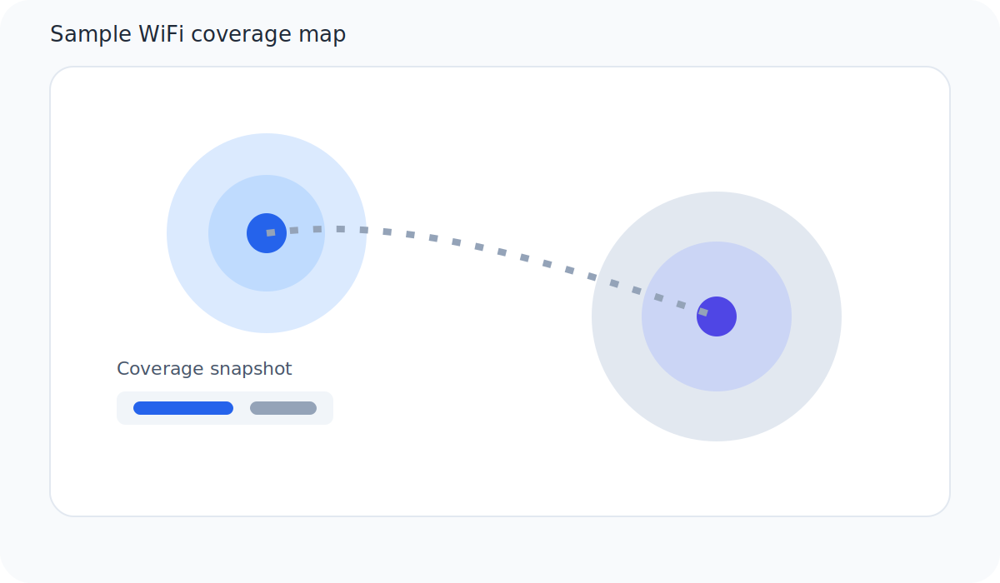

---
date:
  created: 2026-02-06
categories:
  - Writing
  - Reference
draft: true
---

# Markdown Reference Post (All Examples)

This sample post shows common Markdown patterns used for technical blogs. Copy any section you need.
<!-- more -->

## Image + Caption


*Figure 1: A simple coverage map illustration you can replace with your own image.*

## Two Columns (Responsive)

<div class="two-column" markdown="1">
  <div markdown="1">

**Left column**

- Quick notes
- Short lists
- Definitions

**Signal tip:** Aim for `-65 dBm` or better for good roaming.

  </div>
  <div markdown="1">

**Right column**

- Results
- Mini tables
- Warnings

**Client tip:** Test with a real client device, not just the AP dashboard.

  </div>
</div>


## Table

| Test        | Band    | Channel | Avg Throughput |
| ----------- | ------- | ------- | -------------- |
| Living Room | 5 GHz   | 36      | 412 Mbps       |
| Office      | 5 GHz   | 44      | 366 Mbps       |
| Garage      | 2.4 GHz | 6       | 72 Mbps        |

## Code (Inline + Block)

Inline code looks like `iwconfig` or `iperf3`.

```bash
# Quick throughput test (server)
iperf3 -s

# Client
iperf3 -c 192.168.1.10 -P 4
```

```python
def normalize_rssi(rssi_dbm: int) -> str:
    if rssi_dbm >= -50:
        return "Excellent"
    if rssi_dbm >= -65:
        return "Good"
    return "Weak"
```

## Text Styles

- *Italic text* for emphasis.
- **Bold text** for strong emphasis.
- <u>Underlined text</u> when you want a visual callout.
- ~~Strikethrough~~ for removed or deprecated ideas.

## Lists

### Numbered List

1. Survey the area and document dead zones.
2. Adjust channels to reduce interference.
3. Re-test from the same client devices.

### Bullet List

- Place APs away from metal or concrete.
- Use 5 GHz for performance.
- Use 2.4 GHz for reach.

### Task List

- [x] Record baseline throughput
- [ ] Change channel plan
- [ ] Re-test and log results

### Definition List

RSSI
: Received Signal Strength Indicator, measured in dBm.

SNR
: Signal-to-Noise Ratio, measured in dB.

## Notes, Warnings, Tips, and More

!!! note
    Use notes to provide helpful context without interrupting the main flow.

!!! tip
    Keep client drivers up to date before blaming the network.

!!! warning
    Overlapping channels can destroy throughput in busy environments.

!!! warning "Caution"
    Make one change at a time, or you won't know what fixed the issue.

!!! note "Remember"
    Measure before and after every change.

!!! quote
    "If you can't measure it, you can't improve it."

## Quote Block

> This is a standard blockquote. Use it for citations or important reminders.

## Footnote Example

This sentence has a footnote reference.[^1]

[^1]: This is the footnote text. Great for sources or extra detail.

## How To Change Heading Fonts Site-Wide

Add this to `docs/styles/extra.css` to change heading fonts everywhere:

```css
.md-typeset h1,
.md-typeset h2,
.md-typeset h3,
.md-typeset h4,
.md-typeset h5,
.md-typeset h6 {
  font-family: "Space Grotesk", "Inter", system-ui, sans-serif;
  letter-spacing: -0.01em;
}
```

If you want a different font, update the `theme.font` section in `mkdocs.yml` and then adjust the CSS above.

## Extra Ideas You Can Try Next

- Add diagrams with Mermaid (great for network flows).
- Use tabs for "Windows/Linux/macOS" command variants.
- Add callout boxes for troubleshooting checklists.
